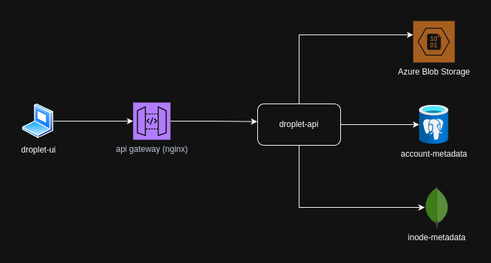
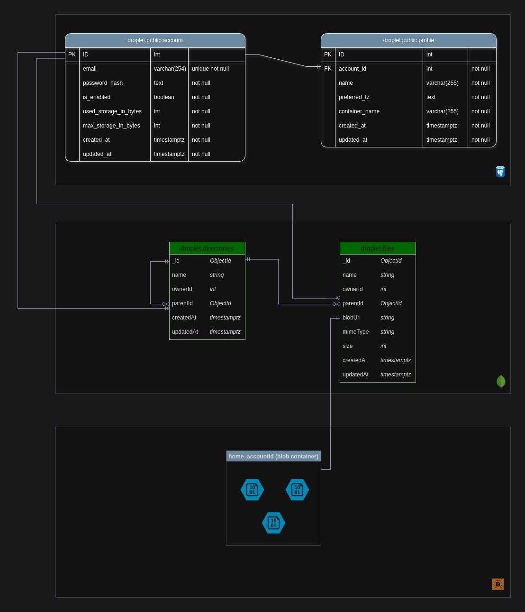

  

---

# Droplet

**Droplet** is a minimal, secure, and modern file-storage application.

> [!NOTE]
> **Droplet** is an education project and is actively under development.
> Design choices and feature priorities reflect personal learning goals, not production readiness.
> You many encounter over-engineered or under-engineered solutions. This is not intended for real-world deployment.

## Table of contents

- [Design](#design)
    - [High Level Design](#high-level-design)
    - [Entity Relationship Diagram](#entity-relationship-diagram)
- [Lices](#license)

## Design

### High Level Design

### Entity Relationship Diagram

## License

This project is released under MIT LICENSE, a copy of which can be found [here](./LICENSE)